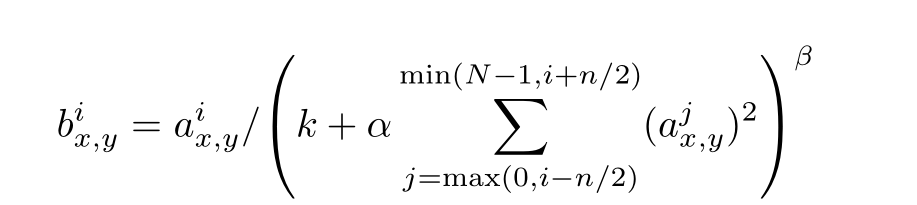
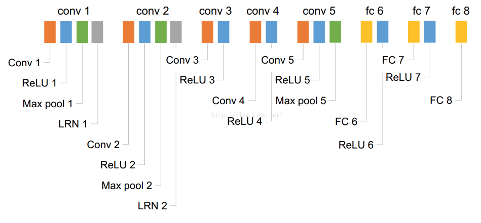
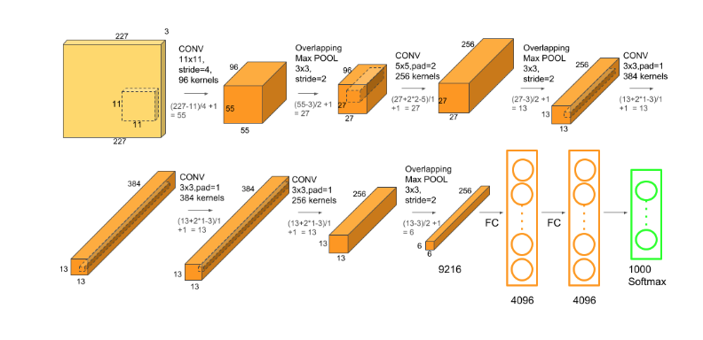

# AlexNet
翻译：https://blog.csdn.net/qianqing13579/article/details/71381016?locationNum=15&fps=1 

资料：
https://blog.csdn.net/langb2014/article/details/48286501 
https://www.learnopencv.com/understanding-alexnet/ 

## LRN Local Response Normalization

论文公式中的N表示通道数(channel)。a,n/2,k,α,β分别表示函数中的input,depth_radius,bias,alpha,beta，其中n/2,k,α,β都是自定义的，特别注意一下∑叠加的方向是沿着通道方向的，即每个点值的平方和是沿着a中的第3维channel方向的，也就是一个点同方向的前面n/2个通道（最小为第0个通道）和后n/2个通道（最大为第d-1个通道）的点的平方和(共n+1个点)。

https://blog.csdn.net/program_developer/article/details/79430119 

https://blog.csdn.net/yangdashi888/article/details/77918311 

上面这段话的意思，比如i=1即第1个（序号0）核（这里的第几个核说通俗点就是对第几层做处理）n/2=1时，那么只对这个数和他的下一层的那个数进行平方和，n/2=2那就是对下两层的数共三个数进行平方和。看不懂的话看代码就很直观了。

## 网络分析
网络： 

具体参数： 

| NO. | Layer  | Input Size | Kernel Size | Stride | Pad | Output Size | Receptive Field |       神经元数量      |     参数数量      |       连接数数量      |
|:----:|:----:|:----:|:----:|:----:|:----:|:----:|:----:|:----:|:----:|:----:|
|1    |conv1   |227\*227\*3 |   11\*11\*96|   4    |     |55\*55\*96   |        11      |           290400       |       34944       |         105705600     |
|2    |pooling1|55\*55\*96  |      3\*3   |   2    |     |27\*27\*96   |        19      |           69984        |                   |          629856       |
|3    |conv2   |27\*27\*96  |   5\*5\*256 |   1    |  2  |27\*27\*256  |        51      |          186624        |       614656      |        448084224      |
|4    |pooling2|27\*27\*256 |     3\*3    |   2    |     |13\*13\*256  |        67      |          43264         |                   |          389376       |
|5    |conv3   |13\*13\*256 |  3\*3\*384  |   1    |  1  |13\*13\*384  |        99      |           64896        |       885120      |          149585280    |
|6    |conv4   |13\*13\*384 |  3\*3\*384  |   1    |  1  |13\*13\*384  |        131     |           64896        |       1327488     |          224345472    |
|7    |conv5   |13\*13\*384 |  3\*3\*256  |   1    |  1  |13\*13\*256  |        163     |           43264        |       884992      |          149563648    |
|8    |pooling5|13\*13\*256 |     3\*3    |   2    |     |6\*6\*256    |        195     |          9216          |                   |          82944        |
|9    |fc6     |6\*6\*256   |             |        |     |4096         |                |          4096          |       37748736    |          37748736     |
|10   |fc7     |4096        |             |        |     |4096         |                |          4096          |       16777216    |          16777216     |

### 概要

LeNet正式提出cnn的思想，则AlexNet奠定了cnn的地位。 
将图像分类从传统的分类方式正式带向cnn方向，由于数据和GPU的计算力共同提高下，构建了当时最大的卷积神经网络，并获得了最优结果。 
同时论文突出了两方面的问题： 
1.怎样在这个大型网络下提高性能的同时减少训练时间。 
2.大型网络有大量的参数，怎样去防止过拟合。

### 怎样在这个大型网络下提高性能的同时减少训练时间

+ 提出ReLU激活函数
在CIFAR-10数据集上达到25%训练错误率比同等条件下使用tanh神经元快6倍
+ 多GPU训练
使用多GPU训练一方面是受单个GPU的显存限制，一方面是加快训练
在多GPU之间并不是所有层都互相通信，只在某些层进行交互通信。
+ 局部响应归一化
在论文中局部归一化确实使性能有所提高
（响应归一化将top-1和top-5的错误率分别降低了1.4%和1.2%）
但是在后续研究中，对于越大的网络。局部响应归一化并没有带来提升，所以这个技术被淡化，基本不再使用。
+ 重叠池化
池化步长小于池化尺寸就是重叠池化
实验证明重叠池化带来了性能上的提升（将top-1和top-5的错误率分别降低了0.4%和0.3%）
重叠池化也在一定程度上抑制了过拟合

【我的思考】 
1.relu激活函数的特性让求导变得更加简单 
2.多GPU让所有层都进行交互会产生怎样的区别？

### 大型网络有大量的参数，怎样去防止过拟合

+ 数据增强
降低过拟合最简单直接的方式就是扩大数据集
论文中扩大数据集的方式： 
1.从256x256的图像中随机提取224x224大小的块以及他们的翻转图像构成新的数据集（可扩展(256-224)2*2=2048倍）。预测方针是：提取5个224x224块（四个边角块和一个中心块）以及它们的水平翻转（因此共十个块）做预测，然后网络的softmax层对这十个块做出的预测取均值。 
2.改变训练图像的RGB通道的强度
相当于改变了图像的光照、颜色、强度，但是目标特性任然不变。

+ dropout
每一个隐藏神经元都有0.5的概率不参与前向传播和反向传播。
每一次迭代隐藏神经元的训练对象都是在变的

【我的思考】
1.越大的网络对数据的依赖越大，训练复杂网络必须要有足够的数据量支撑，在相似分类的情况下可以使用迁移学习从一定程度上减小这种依赖 
2.drop让更多的隐藏神经元参与进来，让激活较少的神经元得到迭代更新，使得网络泛华能力更强

