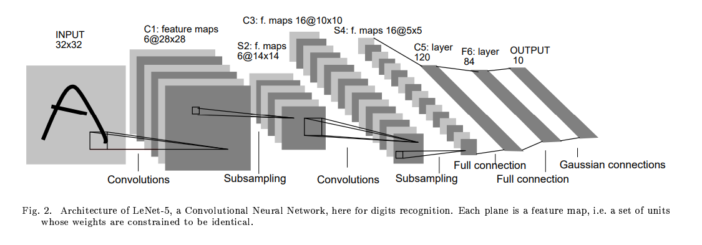
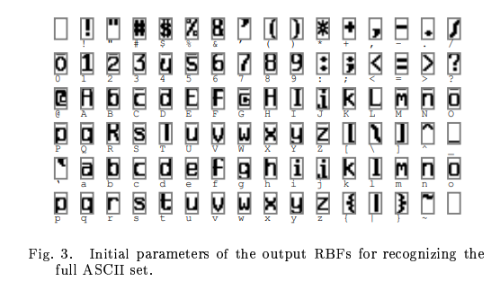
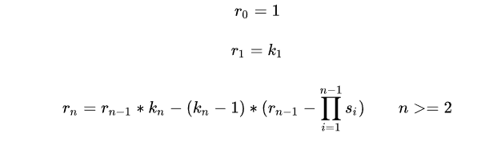
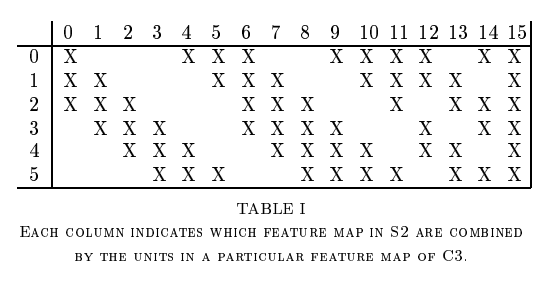

# LeNet
翻译：https://blog.csdn.net/qianqing13579/article/details/71076261 

参考：https://www.jianshu.com/p/9997c6f5c01e 

https://cuijiahua.com/blog/2018/01/dl_3.html 

https://blog.csdn.net/qianqing13579/article/details/71076261 

https://blog.csdn.net/zoeyunjj/article/details/51643650 

## 内容简述
第一部分：简述。 
不管是语音、图形、还是其他模式类型，模式识别纯靠手动设计是不可能的。过去使用两个模块来进行，第一个模块是特征提取器，第二个模块是可训练的分类器，分类器的适用范围又限制在了低维度空间的容易分别的类别，因此又需要合适的特征提取器去配合工作。但是过去十年中又有三方面的因素结合改变了这一现象：1.成本低、运算速度快的机器慢慢普及，使得可以直接使用“暴力计算”而不用太大程度依赖于计算方法的优化；2.大型数据集的可用性使得设计人员在设计识别系统时可以更多地依赖数据本身而不是依赖手动设计的特征提取器；3.最重要的一点是，在大数据集下，强大的机器学习技术变得可用了，也使得可以处理高维度输入、生成更复杂的决策函数。

第二部分：对分离的字符识别的卷积网络 
从两个方面说了全连接网络的弊端，引出卷积网络的位移不变性(shift invariance)可以通过权值共享实现、提取特征通过将隐藏结点的感受野(local receptive fields)限制在了局部。(Convolutional Networks force the extraction of local features by restricting the receptive fields of hidden units to be local.)
A.卷积网络：CNN通过局部感受野(local receptive fields)，权值共享(shared weights)，下采样(sub-sampling)实现位移，缩放，和形变不变性(shift, scale, distortion invariance);LeNet-5，输入层是归一化并且字符位于中间的字符图像；每层的每个神经元的输入是上一层的局部几个神经元（局部感受野）；作卷积时同层每个不同的局部都共用同一个卷积核（权值共享）；在特征图中降低特征位置的精度的方式是降低特征图的空间分辨率，这个可以通过下采样层达到，下采样层通过求局部平均降低特征图的分辨率，并且降低了输出对平移和形变的敏感度； 
B.LeNet-5：

LeNet-5：

输入图像大小：32\*32
1.C1层：6个5\*5的卷积核，步长1，则(32-5)+1=28，故输出28\*28\*6。神经元数量为28\*28\*6=784\*6=4704个。参数有((5\*5)+1)\*6=156个（1是bias偏置）。连接数一共156\*28\*28=122304个（C1每个神经元接受输入5\*5的局部图像并带1个偏置，所以1个神经元有26个连接）。

2.S2层：方式：2\*2输入相加乘以一个参数，加上一个偏置，通过sigmoid得到结果。6个2\*2池化，步长2，则((28-2)/2)+1=14，故输出14\*14\*6。神经元数量为14\*14\*6=1176个。参数有2\*6=12个（每层2个参数）。连接数一共5\*14\*14\*6=5880个（每个神经元接收4+1=5个输入）。

3.C3层：5\*5的卷积核，0-5有3层，6-14有4层，15有6层。步长1，则(32-5)+1=28，故输出10\*10\*16。神经元数量为10\*10\*16=1600个。参数计算，因为单层卷积有5\*5=25个参数，共有6\*3+9\*4+6=60层，故共有25\*60=1500个参数，再加上每次计算完一次完整卷积时要加上的偏置，共1500+16=1516个参数。连接数一共1516\*10\*10=151600个。

4.S4层：方式：2\*2输入相加乘以一个参数，加上一个偏置，通过sigmoid得到结果。16个2\*2池化，步长2，则((10-2)/2)+1=5，故输出5\*5\*16。神经元数量为5\*5\*16=400个。参数有2\*16=32个（每层2个参数）。连接数一共5\*5\*5\*16=2000个（每个神经元接收4+1=5个输入）。

5.C5层：120个5\*5的卷积核，步长1，则(5-5)+1=1，故输出1\*1\*120。神经元数量为1\*1\*120=120个。参数有120\*（16\*5\*5+1）=48120个（1是bias偏置）。连接数一共48120个。

6.F6层：全连接层，1\*1\*84相当于一个7*12的比特图，参数共120\*84+84=10164个。

7.Output: 输出层(其实就是softmax loss)由欧式径向基函数（Euclidean Radial Basis Function,RBF）单元组成。

F6： 

感受野计算： 

C3层连接： 

| NO. | Layer | Input Size | Kernel Size | Stride | Output Size | Receptive Field |       神经元数量      |     参数数量      |       连接数数量      |
|:----:|:----:|:----:|:----:|:----:|:----:|:----:|:----:|:----:|:----:|
|1    |C1     |32\*32      |      5\*5\*6|   1    |28\*28\*6    |        5       |           4704         |        156        |         122304        |
|2    |S2     |28\*28\*6   |      2\*2   |   2    |14\*14\*6    |        6       |           1176         |         12        |          5880         |
|3    |C3     |14\*14\*6   |     5\*5\*16|   1    |10\*10\*16   |        14      |           1600         |         1516      |         151600        |
|4    |S4     |10\*10\*16  |     2\*2    |   2    |5\*5\*16     |        16      |           400          |         32        |           2000        |
|5    |C5     |5\*5\*16    |  5\*5\*120  |   1    |1\*1\*120    |        32      |           120          |       48120       |           48120       |
|6    |F6     |1\*1\*120   |             |        |1\*1\*84     |                |           84           |       10164       |           10164       |

总计60000个参数，8084个神经元。

## Q&A
Q：为什么采用C3层这种部分（不对称）连接的方式？
A：文中说到有两个原因：一是为了减少连接数量（也减少了参数数量），二是为了破坏网络的对称性，由不同的输入希望可以提取到不同的特征。

Q：为什么后面发展的网络不采用这种不对称连接？